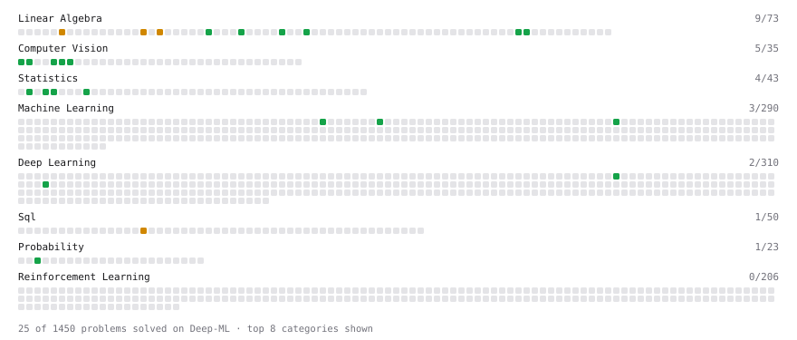

# Deep-ML

My machine learning practice from [Deep-ML](https://www.deep-ml.com). Every solution here was written by hand.

**17** solved · 17 problems · 0 labs · 0 math

[**Browse the interactive portfolio**](https://Nishant-9696.github.io/deep-ml/) to replay this filling in over time.

## Problems

| | Difficulty | Solved | |
| --- | --- | --- | --- |
| [Apply Zero Padding to an Image](https://www.deep-ml.com/problems/239) | easy | 2026-09-20 | [solution](problems/0239-apply-zero-padding-to-an-image) |
| [Bhattacharyya Distance Between Two Distributions](https://www.deep-ml.com/problems/120) | easy | 2026-09-22 | [solution](problems/0120-bhattacharyya-distance-between-two-distributions) |
| [Calculate Image Brightness](https://www.deep-ml.com/problems/70) | easy | 2026-09-19 | [solution](problems/0070-calculate-image-brightness) |
| [Calculate P50/P95/P99 Latency Percentiles](https://www.deep-ml.com/problems/293) | easy | 2026-09-22 | [solution](problems/0293-calculate-p50-p95-p99-latency-percentiles) |
| [Convert RGB Image to Grayscale](https://www.deep-ml.com/problems/237) | easy | 2026-09-20 | [solution](problems/0237-convert-rgb-image-to-grayscale) |
| [Descriptive Statistics Calculator](https://www.deep-ml.com/problems/78) | easy | 2026-09-21 | [solution](problems/0078-descriptive-statistics-calculator) |
| [Flip an Image Horizontally or Vertically](https://www.deep-ml.com/problems/238) | easy | 2026-09-20 | [solution](problems/0238-flip-an-image-horizontally-or-vertically) |
| [Grayscale Image Contrast Calculator](https://www.deep-ml.com/problems/82) | easy | 2026-09-20 | [solution](problems/0082-grayscale-image-contrast-calculator) |
| [Implement Compressed Column Sparse Matrix Format (CSC)](https://www.deep-ml.com/problems/67) | easy | 2026-09-19 | [solution](problems/0067-implement-compressed-column-sparse-matrix-format-csc) |
| [Implement the Hardtanh Activation Function](https://www.deep-ml.com/problems/266) | easy | 2026-09-16 | [solution](problems/0266-implement-the-hardtanh-activation-function) |
| [Implement the Square ReLU Activation Function](https://www.deep-ml.com/problems/373) | easy | 2026-09-16 | [solution](problems/0373-implement-the-square-relu-activation-function) |
| [Measure Disorder in Apple Colors](https://www.deep-ml.com/problems/108) | easy | 2026-09-17 | [solution](problems/0108-measure-disorder-in-apple-colors) |
| [Poisson Distribution Probability Calculator](https://www.deep-ml.com/problems/81) | easy | 2026-09-21 | [solution](problems/0081-poisson-distribution-probability-calculator) |
| [Shift and Scale Array to Target Range](https://www.deep-ml.com/problems/141) | easy | 2026-09-17 | [solution](problems/0141-shift-and-scale-array-to-target-range) |
| [Tensor Puzzle: Circular Roll by One](https://www.deep-ml.com/problems/1277) | easy | 2026-09-15 | [solution](problems/1277-tensor-puzzle-circular-roll-by-one) |
| [Tensor Puzzle: Reverse a Vector](https://www.deep-ml.com/problems/1278) | easy | 2026-09-15 | [solution](problems/1278-tensor-puzzle-reverse-a-vector) |
| [Calculate Eigenvalues of a Matrix](https://www.deep-ml.com/problems/6) | medium | 2026-09-18 | [solution](problems/0006-calculate-eigenvalues-of-a-matrix) |

---

_This file is regenerated by Deep-ML on every push._
