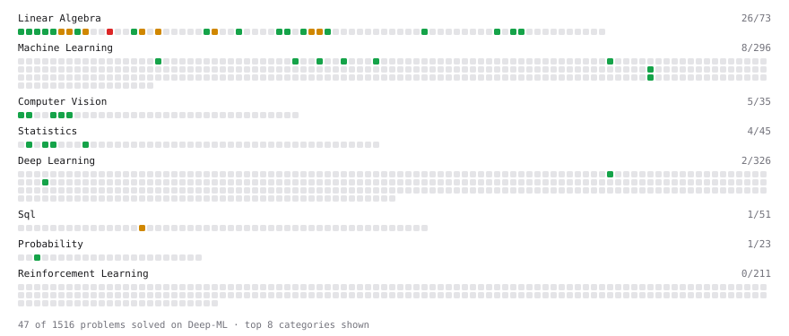

# Deep-ML

My machine learning practice from [Deep-ML](https://www.deep-ml.com). Every solution here was written by hand.

**56** solved · 47 problems · 0 labs · 9 math

[**Browse the interactive portfolio**](https://Nishant-9696.github.io/deep-ml/) to replay this filling in over time.

## Problems

| | Difficulty | Solved | |
| --- | --- | --- | --- |
| [Apply Zero Padding to an Image](https://www.deep-ml.com/problems/239) | easy | 2026-09-20 | [solution](problems/0239-apply-zero-padding-to-an-image) |
| [Bhattacharyya Distance Between Two Distributions](https://www.deep-ml.com/problems/120) | easy | 2026-09-22 | [solution](problems/0120-bhattacharyya-distance-between-two-distributions) |
| [Binary Classification with Logistic Regression](https://www.deep-ml.com/problems/104) | easy | 2026-09-26 | [solution](problems/0104-binary-classification-with-logistic-regression) |
| [Calculate 2x2 Matrix Inverse](https://www.deep-ml.com/problems/8) | easy | 2026-10-01 | [solution](problems/0008-calculate-2x2-matrix-inverse) |
| [Calculate Image Brightness](https://www.deep-ml.com/problems/70) | easy | 2026-09-19 | [solution](problems/0070-calculate-image-brightness) |
| [Calculate Mean by Row or Column](https://www.deep-ml.com/problems/4) | easy | 2026-09-29 | [solution](problems/0004-calculate-mean-by-row-or-column) |
| [Calculate P50/P95/P99 Latency Percentiles](https://www.deep-ml.com/problems/293) | easy | 2026-09-22 | [solution](problems/0293-calculate-p50-p95-p99-latency-percentiles) |
| [Calculate SVM Margin Width](https://www.deep-ml.com/problems/282) | easy | 2026-09-24 | [solution](problems/0282-calculate-svm-margin-width) |
| [Check Linear Independence of Vectors](https://www.deep-ml.com/problems/331) | easy | 2026-10-02 | [solution](problems/0331-check-linear-independence-of-vectors) |
| [Convert RGB Image to Grayscale](https://www.deep-ml.com/problems/237) | easy | 2026-09-20 | [solution](problems/0237-convert-rgb-image-to-grayscale) |
| [Convert Vector to Diagonal Matrix](https://www.deep-ml.com/problems/35) | easy | 2026-09-29 | [solution](problems/0035-convert-vector-to-diagonal-matrix) |
| [Descriptive Statistics Calculator](https://www.deep-ml.com/problems/78) | easy | 2026-09-21 | [solution](problems/0078-descriptive-statistics-calculator) |
| [Dot Product Calculator](https://www.deep-ml.com/problems/83) | easy | 2026-09-25 | [solution](problems/0083-dot-product-calculator) |
| [Empirical Probability Mass Function (PMF)](https://www.deep-ml.com/problems/184) | easy | 2026-09-23 | [solution](problems/0184-empirical-probability-mass-function-pmf) |
| [Flip an Image Horizontally or Vertically](https://www.deep-ml.com/problems/238) | easy | 2026-09-20 | [solution](problems/0238-flip-an-image-horizontally-or-vertically) |
| [Grayscale Image Contrast Calculator](https://www.deep-ml.com/problems/82) | easy | 2026-09-20 | [solution](problems/0082-grayscale-image-contrast-calculator) |
| [Implement Compressed Column Sparse Matrix Format (CSC)](https://www.deep-ml.com/problems/67) | easy | 2026-09-19 | [solution](problems/0067-implement-compressed-column-sparse-matrix-format-csc) |
| [Implement Early Stopping Based on Validation Loss](https://www.deep-ml.com/problems/135) | easy | 2026-09-27 | [solution](problems/0135-implement-early-stopping-based-on-validation-loss) |
| [Implement the Hardtanh Activation Function](https://www.deep-ml.com/problems/266) | easy | 2026-09-16 | [solution](problems/0266-implement-the-hardtanh-activation-function) |
| [Implement the Square ReLU Activation Function](https://www.deep-ml.com/problems/373) | easy | 2026-09-16 | [solution](problems/0373-implement-the-square-relu-activation-function) |
| [L2 Normalization Along an Axis](https://www.deep-ml.com/problems/1022) | easy | 2026-09-28 | [solution](problems/1022-l2-normalization-along-an-axis) |
| [Linear Kernel Function](https://www.deep-ml.com/problems/45) | easy | 2026-09-27 | [solution](problems/0045-linear-kernel-function) |
| [Matrix Determinant & Trace](https://www.deep-ml.com/problems/195) | easy | 2026-09-30 | [solution](problems/0195-matrix-determinant-trace) |
| [Matrix-Vector Dot Product](https://www.deep-ml.com/problems/1) | easy | 2026-09-29 | [solution](problems/0001-matrix-vector-dot-product) |
| [Measure Disorder in Apple Colors](https://www.deep-ml.com/problems/108) | easy | 2026-09-17 | [solution](problems/0108-measure-disorder-in-apple-colors) |
| [Pairwise Cosine Similarity Matrix](https://www.deep-ml.com/problems/1072) | easy | 2026-09-29 | [solution](problems/1072-pairwise-cosine-similarity-matrix) |
| [Poisson Distribution Probability Calculator](https://www.deep-ml.com/problems/81) | easy | 2026-09-21 | [solution](problems/0081-poisson-distribution-probability-calculator) |
| [Reshape Matrix](https://www.deep-ml.com/problems/3) | easy | 2026-09-29 | [solution](problems/0003-reshape-matrix) |
| [Scalar Multiplication of a Matrix](https://www.deep-ml.com/problems/5) | easy | 2026-09-29 | [solution](problems/0005-scalar-multiplication-of-a-matrix) |
| [Shift and Scale Array to Target Range](https://www.deep-ml.com/problems/141) | easy | 2026-09-17 | [solution](problems/0141-shift-and-scale-array-to-target-range) |
| [Tensor Puzzle: Circular Roll by One](https://www.deep-ml.com/problems/1277) | easy | 2026-09-15 | [solution](problems/1277-tensor-puzzle-circular-roll-by-one) |
| [Tensor Puzzle: First-Order Difference](https://www.deep-ml.com/problems/1275) | easy | 2026-09-28 | [solution](problems/1275-tensor-puzzle-first-order-difference) |
| [Tensor Puzzle: Reverse a Vector](https://www.deep-ml.com/problems/1278) | easy | 2026-09-15 | [solution](problems/1278-tensor-puzzle-reverse-a-vector) |
| [Top Quartile Reward Score Filter](https://www.deep-ml.com/problems/778) | easy | 2026-09-27 | [solution](problems/0778-top-quartile-reward-score-filter) |
| [Transpose of a Matrix](https://www.deep-ml.com/problems/2) | easy | 2026-09-29 | [solution](problems/0002-transpose-of-a-matrix) |
| [Vector Element-wise Sum](https://www.deep-ml.com/problems/121) | easy | 2026-09-25 | [solution](problems/0121-vector-element-wise-sum) |
| [Vector Norms (L1/L2/L-inf) and the Frobenius Norm](https://www.deep-ml.com/problems/328) | easy | 2026-09-25 | [solution](problems/0328-vector-norms-l1-l2-l-inf-and-the-frobenius-norm) |
| [2D Translation Matrix Implementation](https://www.deep-ml.com/problems/55) | medium | 2026-09-24 | [solution](problems/0055-2d-translation-matrix-implementation) |
| [Calculate Correlation Matrix](https://www.deep-ml.com/problems/37) | medium | 2026-09-23 | [solution](problems/0037-calculate-correlation-matrix) |
| [Calculate Eigenvalues of a Matrix](https://www.deep-ml.com/problems/6) | medium | 2026-09-18 | [solution](problems/0006-calculate-eigenvalues-of-a-matrix) |
| [Compute the Null Space (Kernel) of a Matrix](https://www.deep-ml.com/problems/330) | medium | 2026-10-06 | [solution](problems/0330-compute-the-null-space-kernel-of-a-matrix) |
| [Find the column space of a matrix](https://www.deep-ml.com/problems/68) | medium | 2026-10-07 | [solution](problems/0068-find-the-column-space-of-a-matrix) |
| [Matrix Rank](https://www.deep-ml.com/problems/329) | medium | 2026-10-02 | [solution](problems/0329-matrix-rank) |
| [Matrix times Matrix ](https://www.deep-ml.com/problems/9) | medium | 2026-09-29 | [solution](problems/0009-matrix-times-matrix) |
| [Matrix Transformation ](https://www.deep-ml.com/problems/7) | medium | 2026-09-29 | [solution](problems/0007-matrix-transformation) |
| [Running Total and Moving Average with Window Frames](https://www.deep-ml.com/problems/1116) | medium | 2026-09-25 | [solution](problems/1116-running-total-and-moving-average-with-window-frames) |
| [Determinant of a 4x4 Matrix using Laplace's Expansion (hard)](https://www.deep-ml.com/problems/13) | hard | 2026-10-01 | [solution](problems/0013-determinant-of-a-4x4-matrix-using-laplace-s-expansion-hard) |

## Math

| | Difficulty | Solved | |
| --- | --- | --- | --- |
| [Matrix Basics](https://www.deep-ml.com/math-problems/9) | easy | 2026-09-25 | [solution](math/0009-matrix-basics) |
| [Vector Operations](https://www.deep-ml.com/math-problems/7) | easy | 2026-09-25 | [solution](math/0007-vector-operations) |
| [Determinants and Trace](https://www.deep-ml.com/math-problems/11) | medium | 2026-09-30 | [solution](math/0011-determinants-and-trace) |
| [Information Theory: Entropy](https://www.deep-ml.com/math-problems/24) | medium | 2026-09-25 | [solution](math/0024-information-theory-entropy) |
| [Inverse and Rank](https://www.deep-ml.com/math-problems/12) | medium | 2026-09-30 | [solution](math/0012-inverse-and-rank) |
| [Matrix Multiplication](https://www.deep-ml.com/math-problems/10) | medium | 2026-09-25 | [solution](math/0010-matrix-multiplication) |
| [Softmax and Cross-Entropy](https://www.deep-ml.com/math-problems/32) | medium | 2026-09-25 | [solution](math/0032-softmax-and-cross-entropy) |
| [The Four Fundamental Subspaces](https://www.deep-ml.com/math-problems/46) | medium | 2026-09-30 | [solution](math/0046-the-four-fundamental-subspaces) |
| [Vector Norms and Linear Independence](https://www.deep-ml.com/math-problems/8) | medium | 2026-09-25 | [solution](math/0008-vector-norms-and-linear-independence) |

---

_This file is regenerated by Deep-ML on every push._
